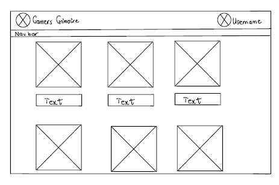
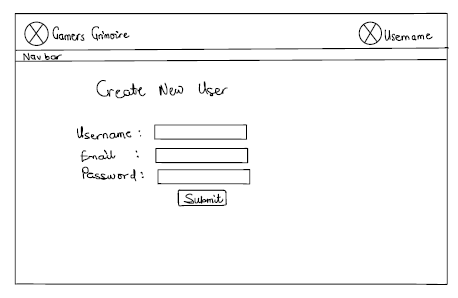
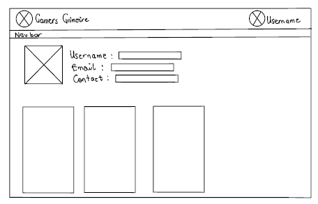
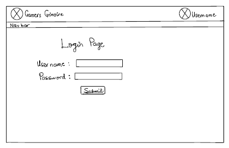

# Gamer's Grimoire

## Overview

Remembering which video games to play can be a daunting task, especially with so many titles vying for your attention. Enter A **Gamer's Grimoire**

**A Gamer's Grimoire** is a web app designed to help users manage their ever-growing backlogs of unplayed video games. Users can register and log in to catalog their games, track their progress, and set personal completion goals. Once logged in, they can easily add games to their backlog, update their status, and rate and provide feedback on games for others to view. This empowers users to take control of their gaming journey and make the most of their leisure time while fostering a community of shared gaming experiences.


## Data Model
The application will store **Users**, **Game Lists**, and **Games**.

- **Users** can have multiple game lists, with each list referenced to the user.
- Each **Game List** can contain multiple games, which will be embedded within the list to maintain organization.
- Each **Game** will have properties such as:
  - **Title**: The name of the game.
  - **Genre**: The type or category of the game.
  - **Status**: The current progress status (e.g., unplayed, in progress, completed).
  - **Rating**: A numerical or star rating that users can assign to the game.
  - **Feedback**: User comments or reviews about the game, allowing them to share their experiences with others.

(__TODO__: sample documents)

An Example User:

```javascript
{
  username: "Bond007",
  hash: "$2b$10$e5pA3J6yPz2B1kP3zWwH6eHq9G1u5W/UqHMPA0QnIkv2sA4S3sygG", // a password hash (example hash for "securePassword123")
  email: "bondd007@example.com", // User's email address
  gameLists: [ // an array of references to Game List documents
    "634d3f64d3762f0048c72421", // example list ID 1
    "634d3f64d3762f0048c72422"  // example list ID 2
  ]
  profilePicture: "https://example.com/profile-pic.jpg", // URL to user's profile picture
  bio: "Just a passionate gamer who loves exploring new worlds and conquering challenges!", // Short bio about the user
  favoriteGenres: ["Action-Adventure", "RPG", "Puzzle"],
  createdAt: "2024-10-31T12:00:00Z", // timestamp of user account creation
  lastLogin: "2024-10-31T15:00:00Z", // timestamp of last login
}

```

An Example List with Embedded Items:

```javascript
{
  user: "634d3f64d3762f0048c72421", // a reference to a User object
  name: "Favorite Games",
  items: [
    {
      name: "Red Dead Redemption 2",
      genre: "Action-Adventure",
      releaseDate: "2018-10-26",
      platform: ["PC", "PS4", "Xbox One"],
      rating: 9.5, // User's rating for the game
      feedback: "An incredible open world with an engaging story and memorable characters.", // User feedback
      checked: true, // Whether the user has completed or played the game
      createdAt: "2024-10-31T12:00:00Z", // timestamp of when the item was added
    },
    {
      name: "Black Myth: Wukong",
      genre: "Action RPG",
      releaseDate: "2024-12-20", // Future release date
      platform: ["PC", "PS5", "Xbox Series X"],
      rating: null, // Rating can be updated after playing
      feedback: "Excited to play this; the graphics look stunning!", // Placeholder feedback
      checked: false,
      createdAt: "2024-10-31T12:00:00Z",
    },
    {
      name: "WWE 2K24",
      genre: "Sports",
      releaseDate: "2024-03-10",
      platform: ["PC", "PS5", "Xbox Series X"],
      rating: 8.0,
      feedback: "A solid improvement over last year's title, with better gameplay mechanics.", // User feedback
      checked: true,
      createdAt: "2024-10-31T12:00:00Z",
    },
  ],
  createdAt: "2024-10-31T12:00:00Z" // timestamp of when the list was created
}


```

## [Link to Commented First Draft Schema](db.mjs) 

## Wireframes

(__TODO__: wireframes for all of the pages on your site; they can be as simple as photos of drawings or you can use a tool like Balsamiq, Omnigraffle, etc.)

/ - Home Page



/createUser - page for adding a new user



/user - page showing user information



/login - login page



## Site map
 # Gamer's Grimoire Sitemap

- **Home Page**
  - Login
  - Create User
  - User Profile
    - Edit Profile
    - Game Lists
      - Create Game List
      - View Game List
        - Game Details
          - Rate Game
          - Provide Feedback
          - Comment on Reviews
      - Edit Game List
      - Delete Game from List
- **Search Page**
  - Search Results
    - Game Details (from search)
- **Community**
  - User Reviews
  - Comment on Reviews
- **About**
- **Logout**


## User Stories or Use Cases

1. As a non-registered user, I can register a new account on the site so that I can access the full features.
2. As a registered user, I can log in to the site so that I can manage my game lists and provide ratings.
3. As a user, I can create a new game list so that I can organize my favorite games.
4. As a user, I can view all of the game lists I've created in a single list for easy access.
5. As a user, I can add games to an existing game list so that I can track which games I want to play.
6. As a user, I can rate games and provide feedback for other users to view, helping them make informed decisions.
7. As a user, I can check off games I've played from my list so that I can keep track of my progress.
8. As a user, I can edit my profile information to keep my account details up-to-date.
9. As a user, I can search for games by title, genre, or rating so that I can easily find new games to add to my lists.
10. As a user, I can view detailed information about each game, including descriptions, and user ratings.
11. As a user, I can leave comments on other users' reviews to share my thoughts or experiences.
12. As a user, I can delete games from my list if I no longer wish to track them.
13. As a user, I can filter my game lists by rating or completion status to help prioritize which games to play next.
14. As a user, I can log out of the site to secure my account when I am done using it.

## Research Topics

* (5 points) Implement user authentication
    * I will be using Passport.js for user authentication to secure user accounts.
    * An account has been created for testing purposes; I'll share the password via email.
    * See <code>example.com/register</code> for the registration page.
    * See <code>example.com/login</code> for the login page.
* (4 points) Build a game cataloging feature
    * Users will be able to add games to their backlog, including details like title, genre, and status.
    * This will involve creating forms for input and managing state using a JavaScript framework.
* (5 points) Integrate rating and feedback system
    * Users can rate games and leave feedback, which will be displayed on the game detail page.
    * This will require developing a database schema to store ratings and reviews.
* (3 points) Implement search functionality
    * Users will be able to search for games by title, genre, or rating.
    * The search results will display game details with links to their respective pages.


17 points total out of 12 required points (___TODO__: additional points will __not__ count for extra credit)

## [Link to Initial Main Project File](app.mjs)

## Annotations / References Used

1. [Passport.js authentication docs](http://passportjs.org/docs) - (add link to source code that was based on this)
2. [MongoDB schema design](https://mongoosejs.com/docs/guide.html) - (add link to source code that was based on this)
3. [JavaScript form validation techniques](https://developer.mozilla.org/en-US/docs/Learn/Forms/Form_validation) - (add link to source code that was based on this)
4. [React.js documentation](https://reactjs.org/docs/getting-started.html) - (add link to source code that was based on this)
